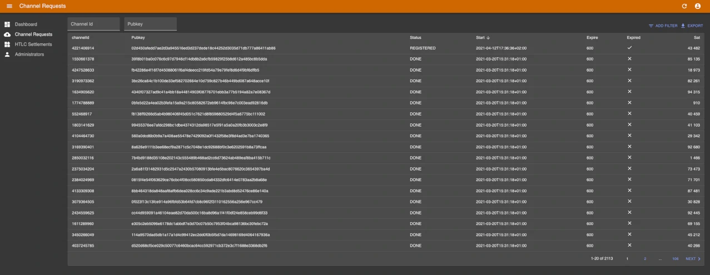

# 💥 Dunder LSP

_Work In Progress, not suited for production just yet._
_Contributions, suggestions and ideas are appreciated._
_Database schema and configuration are bound to change._

Dunder is a Lightning Service Provider for the Bitcoin Lightning Network.

It currently supports "on demand channel openings", meaning if a Lightning wallet
gets an inbound payment while not having any inbound capacity, Dunder will open
a channel to the wallet with push amount equal to the inbound payment minus the
on-chain fee.

More on how this works [here](https://github.com/hsjoberg/blixt-wallet/issues/242).

## Build

Dunder require lnd as the Lightning backend right now, though the plan is to
make the service implementation independent.

The `master` branch always expects the latest version of lnd. Lnd compiled with routerrpc is required.

1. Run lnd, wallet must be unlocked for Dunder to operate correctly
2. `git clone https://github.com/hsjoberg/dunder-lsp && cd dunder-lsp`
3. Copy `config/default.json_TEMPLATE` to `config/default.json` and set up your configuration
4. `yarn`
5. `yarn start`

# Admin interface

  

The admin interface is reachable via `/admin`.

To create an administrator, run `scripts/create-admin-lnurl-auth.js` and scan the QR-code with an
LNURL-auth compatible wallet (for example [Blixt Wallet](https://blixtwallet.github.io)):

`node scripts/create-admin-lnurl-auth.js <listen host:ip> <domain/IP to reach from)> <HTTPS (true/false)>`

This will create a temporary HTTP server serving an LNURL-auth endpoint at /lnurl-auth.

# Test

To do tests run `yarn test` or `yarn test:coverage`.

Any new code should not decerease code coverage significantly.

## License

MIT
